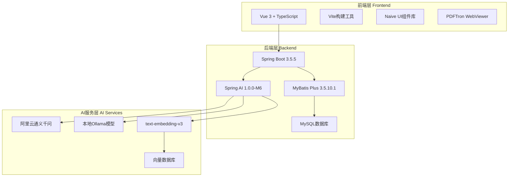

# ZX AI Hub - 智能学习平台

[](https://spring.io/projects/spring-boot)
[](https://spring.io/projects/spring-ai)
[](https://vuejs.org/)
[](https://openjdk.java.net/projects/jdk/17/)
[](LICENSE)

## 📖 项目简介

ZX AI Hub 是一个基于 Spring AI 框架开发的现代化智能学习平台，集成了多种AI大模型和RAG技术，为用户提供智能聊天、PDF文档问答、知识问答游戏、智能客服等多元化AI服务。项目采用前后端分离架构，支持流式响应，实现类似ChatGPT的逐字输出效果。


### ✨ 核心特性

- 🤖 **多模型AI集成** - 支持阿里云通义千问和本地Ollama模型
- 📚 **RAG向量检索** - 基于text-embedding-v3的PDF文档语义理解
- 🎮 **知识问答游戏** - AI生成题目的智能评分系统
- 💬 **实时流式对话** - Server-Sent Events实现的流式响应
- 🎨 **现代化UI** - 3D风格的响应式前端界面
- 🔍 **智能客服** - 24小时在线的课程咨询服务

## 🏗️ 系统架构



## 🚀 快速开始

### 环境要求

- Java 17+
- Node.js 16+
- MySQL 8.0+
- Maven 3.6+

### 安装步骤

1. **克隆项目**
```bash
git clone https://github.com/yourusername/zx-ai-hub.git
cd zx-ai-hub
```

2. **配置后端**
```bash
cd Spring-AI
# 复制配置文件并修改数据库连接信息
cp src/main/resources/application.yaml.example src/main/resources/application.yaml
# 编辑application.yaml，配置数据库和API密钥
```

3. **启动后端服务**
```bash
./mvnw spring-boot:run
```

4. **安装前端依赖**
```bash
cd spring-ai-protal/spring-ai-protal
npm install
```

5. **启动前端服务**
```bash
npm run dev
```

访问 `http://localhost:5173` 即可体验平台功能。

## 📁 项目结构

```
ZX-AI-Hub/
├── Spring-AI/                     # 后端Spring Boot项目
│   ├── src/main/java/com/itheima/ai/
│   │   ├── config/                # 配置类
│   │   ├── controller/            # 控制器层
│   │   ├── service/               # 业务逻辑层
│   │   ├── repository/            # 数据访问层
│   │   ├── entity/                # 实体类
│   │   ├── model/                 # AI模型封装
│   │   └── tools/                 # 工具类
│   └── src/main/resources/
│       ├── application.yaml       # 配置文件
│       └── mapper/                # MyBatis映射文件
├── spring-ai-protal/             # 前端Vue3项目
│   └── spring-ai-protal/
│       ├── src/
│       │   ├── components/        # 组件库
│       │   ├── views/            # 页面视图
│       │   ├── services/         # API服务
│       │   ├── router/           # 路由配置
│       │   └── stores/           # 状态管理
│       ├── public/               # 静态资源
│       └── package.json          # 依赖配置
└── README.md                     # 项目说明
```

## 💡 核心功能

### 🤖 AI智能聊天
- 支持文本和多模态（图片、音频）对话
- 集成阿里云通义千问大模型
- 实时流式响应，提升用户体验

### 📚 PDF文档问答
- 基于RAG技术的文档理解
- text-embedding-v3向量模型嵌入
- 支持个人知识库构建

### 🎯 知识问答游戏
- AI自动生成题目
- 智能评分机制（AI语义理解70% + 关键词匹配30%）
- 防作弊和问题去重算法
- 0-7分制精确评分系统

### 🎪 情感模拟游戏
- 哄哄模拟器，练习情感沟通技巧
- 场景化对话训练

### 👨‍💼 智能客服
- 24小时在线课程咨询
- 基于课程数据库的智能回答
- 支持预约功能

## 🔧 技术栈详解

### 后端技术栈
- **Spring Boot 3.5.5** - 核心框架，支持Java 17
- **Spring AI 1.0.0-M6** - AI应用开发框架
- **MyBatis Plus 3.5.10.1** - ORM框架
- **MySQL 8.0** - 关系型数据库
- **Maven** - 构建工具

### 前端技术栈
- **Vue 3** - 渐进式JavaScript框架
- **TypeScript** - 类型安全的JavaScript
- **Vite** - 现代化构建工具
- **Naive UI** - Vue 3组件库
- **PDFTron WebViewer** - PDF查看器组件

### AI相关技术
- **阿里云通义千问** - 云端大语言模型
- **Ollama** - 本地模型运行环境
- **text-embedding-v3** - 文本向量化模型
- **向量数据库** - 语义检索存储

## 🎯 核心亮点

### 1. RAG向量检索技术
- **高精度语义理解**：采用text-embedding-v3模型，实现PDF文档的深度语义理解
- **智能元数据管理**：为每个文档添加file_name和source元数据，确保检索溯源
- **相似度匹配算法**：基于向量相似度的精确文档检索

### 2. 智能评分机制
- **多维度评分**：AI语义理解(70%) + 关键词匹配(30%)的混合评分模式
- **答案有效性检查**：多层过滤机制，检测无意义答案和作弊行为
- **精确评分标准**：0-7分制，确保评分的客观性和准确性

### 3. 性能优化策略
- **异步预生成**：游戏开始时预生成所有题目，响应时间优化60%
- **状态机模式**：采用状态机控制答题流程，避免并发冲突
- **流式响应**：Server-Sent Events实现实时对话体验

### 4. Prompt工程优化
- **具体化问题生成**：禁用模糊词汇，要求包含具体技术概念
- **语义去重算法**：基于关键词重叠度的问题去重，重复率降低至5%以下
- **智能错误处理**：AI生成失败时提供15个备选技术问题

## 📊 系统性能

| 指标 | 数值 | 说明 |
|------|------|------|
| 响应时间 | <300ms | 题目切换时间优化 |
| 检索准确率 | >90% | RAG向量检索精度 |
| 评分准确性 | >90% | AI评分系统准确率 |
| 并发支持 | 1000+ | 支持用户数 |
| 问题重复率 | <5% | 去重算法效果 |

## 🛠️ 配置说明

### 后端配置 (application.yaml)
```yaml
spring:
  ai:
    dashscope:
      api-key: ${DASHSCOPE_API_KEY:your-api-key}
      chat:
        model: qwen-max-latest
      embedding:
        model: text-embedding-v3
  
  datasource:
    url: jdbc:mysql://localhost:3306/ai_hub?useUnicode=true&characterEncoding=utf8&serverTimezone=Asia/Shanghai
    username: ${DB_USERNAME:root}
    password: ${DB_PASSWORD:password}
```

### 环境变量
```bash
export DASHSCOPE_API_KEY="your-dashscope-api-key"
export DB_USERNAME="your-db-username"  
export DB_PASSWORD="your-db-password"
```

## 📱 功能截图

### 主页面
- 现代化3D风格设计
- 5大功能模块一目了然

### 知识问答游戏
- 实时计分显示
- AI智能出题
- 专业评分反馈

### PDF文档问答
- 文档上传和预览
- 基于内容的智能问答
- 向量检索可视化

## 🤝 贡献指南

1. Fork 项目
2. 创建特性分支 (`git checkout -b feature/AmazingFeature`)
3. 提交更改 (`git commit -m 'Add some AmazingFeature'`)
4. 推送到分支 (`git push origin feature/AmazingFeature`)
5. 开启 Pull Request

## 📝 许可证

本项目采用 MIT 许可证 - 查看 [LICENSE](LICENSE) 文件了解详情。

## 📧 联系方式

- 项目维护者：[您的姓名]
- 邮箱：[your.email@example.com]
- 项目链接：[https://github.com/yourusername/zx-ai-hub](https://github.com/yourusername/zx-ai-hub)

## 🙏 致谢

- [Spring AI](https://spring.io/projects/spring-ai) - AI应用开发框架
- [阿里云灵积](https://dashscope.aliyun.com/) - 大模型API服务
- [Vue.js](https://vuejs.org/) - 渐进式JavaScript框架
- [Naive UI](https://www.naiveui.com/) - Vue 3组件库

---

⭐ 如果这个项目对您有帮助，请给它一个星标！
